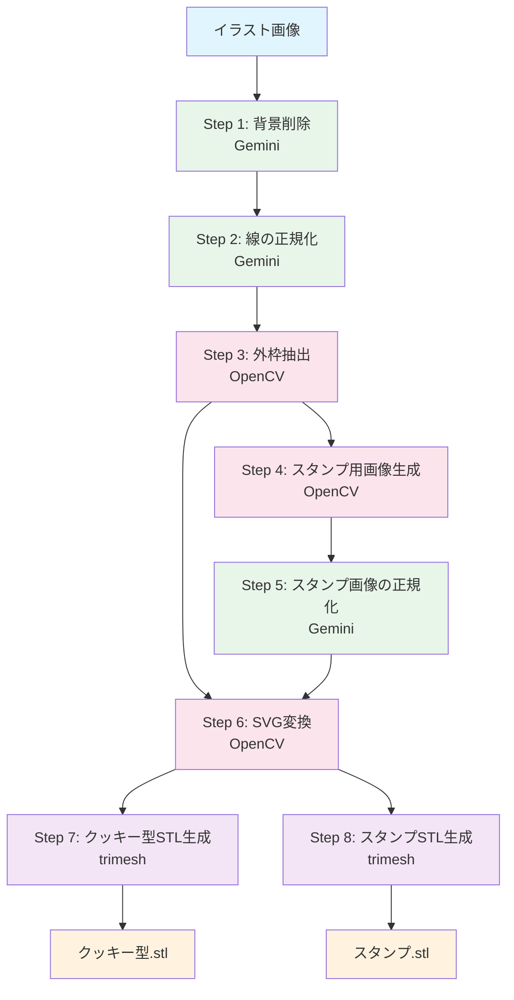

## はじめに

イラストをクッキー型にしたい。そんな思いから、手書き画像から3Dプリンター用のSTLファイルを自動生成するツールを作りました。

このツールは**クッキー型（抜き型）**と**スタンプ（模様を押すもの）**の2つを生成します。

## 完成品

手書きのイラストから、このような3Dモデルが生成されます。

| 入力画像 | クッキー型 | スタンプ |
|:---:|:---:|:---:|
| 手書きイラスト | 外枠の抜き型 | 内部の模様を押すスタンプ |

## 処理の全体像



## 各ステップの詳細

### Step 1: 背景削除（Gemini）

**目的**: 方眼紙やノートの罫線など、背景のノイズを除去する

**処理**: Gemini 2.5 Flashの画像生成機能で背景を純白（#FFFFFF）に置き換える。単純な色置換では罫線と絵の線が交差する部分で問題が起きるため、AIが「絵の一部」と「背景」を意味的に判断して処理する。

### Step 2: 線の正規化（Gemini）

**目的**: 手書きの線の色を統一し、ノイズを除去する

**処理**: 全ての線を黒（#000000）に統一する。線の端にある細いひげや、意図しない飛び出しも除去する。

### Step 3: 外枠抽出（OpenCV）

**目的**: クッキー型の形状となる外枠を抽出する

**処理**: `cv2.findContours`で輪郭検出し、最大面積の輪郭を外枠として採用する。`RETR_EXTERNAL`オプションで最外周の輪郭のみを取得する。

### Step 4: スタンプ用画像の生成（OpenCV）

**目的**: スタンプの模様となる内部要素を抽出する

**処理**: Step 2の正規化画像からStep 3の外枠を差し引く。外枠を膨張（dilate）させてから差し引くことで、境界部分の取り残しを防ぐ。

### Step 5: スタンプ用画像の正規化（Gemini）

**目的**: 差し引き処理で生じたノイズや不完全な線を綺麗にする

**処理**: Step 2と同様にGeminiで線の正規化を行う。

### Step 6: SVG変換（OpenCV）

**目的**: 画像の輪郭をベクターデータに変換する

**処理**: OpenCVで輪郭を検出し、SVGのパスとして書き出す。クッキー型用とスタンプ用の2つのSVGを生成する。

```python
# 輪郭の簡略化（点の数を減らす）
epsilon = 0.01 * cv2.arcLength(contour, True)
approx = cv2.approxPolyDP(contour, epsilon, True)

# スムージング（角を滑らかに）
smoothed = smooth_contour(approx, smoothing=0.2)
```

3Dプリンターで印刷する際、点が多すぎるとファイルサイズが大きくなり、処理が重くなります。適度に簡略化しつつ、スムージングで滑らかな曲線を維持します。

### Step 7: クッキー型STL生成（trimesh）

**目的**: クッキーを抜くための型を3Dモデル化する

**処理**: 外枠のSVGパスを押し出して、抜き型形状を生成する。

```
断面図:
    ┌───┐
    │   │ ← 壁（厚さ1mm）
    │   │
    │   │ ← 高さ10mm
────┘   └────
```

### Step 8: スタンプSTL生成（trimesh）

**目的**: クッキーに模様を押すスタンプを3Dモデル化する

**処理**: 3つの要素を組み合わせてスタンプを生成する。

```
断面図:
      ┌───┐
      │   │ ← 取手（10mm x 10mm x 15mm）
  ────┴───┴────
  │           │ ← 板（厚さ3mm）
  └─┬─────┬─┘
    │     │ ← 凸部分（高さ1.5mm）
```

- **板**: クッキー型の輪郭を1mm内側にオフセットした形状
- **取手**: 板の上に配置された持ち手
- **凸部分**: スタンプ用画像の線を凸として板に配置

## 使い方

```bash
python main.py <画像パス> [オプション]
```

### 基本的なオプション

| オプション | デフォルト | 説明 |
|:--|:--|:--|
| `-o, --output` | output | 出力ディレクトリ |
| `--height` | 10.0 | クッキー型の高さ(mm) |
| `--wall` | 1.0 | 壁の厚さ(mm) |
| `--size` | 50.0 | 目標サイズ(mm) |

### スタンプのオプション

| オプション | デフォルト | 説明 |
|:--|:--|:--|
| `--stamp-plate` | 3.0 | 板の厚さ(mm) |
| `--stamp-handle-size` | 10.0 | 取手の一辺(mm) |
| `--stamp-handle-height` | 15.0 | 取手の高さ(mm) |
| `--stamp-relief` | 1.5 | 凸部分の高さ(mm) |
| `--stamp-line-width` | 1.0 | 凸部分の線幅(mm) |

### 詳細オプション

| オプション | デフォルト | 説明 |
|:--|:--|:--|
| `--epsilon` | 0.01 | 輪郭簡略化の係数 |
| `--smoothing` | 0.2 | スムージングの強さ |
| `--no-stl` | - | STL生成をスキップ |
| `--no-stamp` | - | スタンプ生成をスキップ |
| `--no-simplify` | - | 輪郭の簡略化を無効化 |

## 技術スタック

| 用途 | 技術 |
|:--|:--|
| AI画像処理 | Google Gemini 2.5 Flash（画像生成） |
| 画像処理 | OpenCV |
| 3Dモデル生成 | trimesh |
| 実行環境 | Docker |

## なぜGeminiを使うのか

当初はOpenCVだけで完結させようとしましたが、以下の課題がありました。

1. **背景と絵の分離が難しい**: 単純な二値化では、罫線と絵の線が交差する部分で問題が起きる
2. **ノイズ除去の判断が難しい**: どの線が「意図した線」で、どの線が「ノイズ」かを機械的に判断できない
3. **外枠と内側の分離が難しい**: 線が繋がっているかどうかの判断にコンテキストが必要

これらはAIの「意味的な理解」が必要な問題です。Geminiの画像生成機能を使うことで、人間が見て判断するような処理を自動化できました。

## おわりに

子どもの絵がクッキー型になる瞬間は、想像以上に感動的でした。3Dプリンターをお持ちの方は、ぜひ試してみてください。

リポジトリ: [GitHub](https://github.com/xxx/cookie_mold_maker)

## 参考

- [OpenCV 輪郭検出](https://docs.opencv.org/4.x/d4/d73/tutorial_py_contours_begin.html)
- [trimesh ドキュメント](https://trimsh.org/)
- [Gemini API](https://ai.google.dev/)
